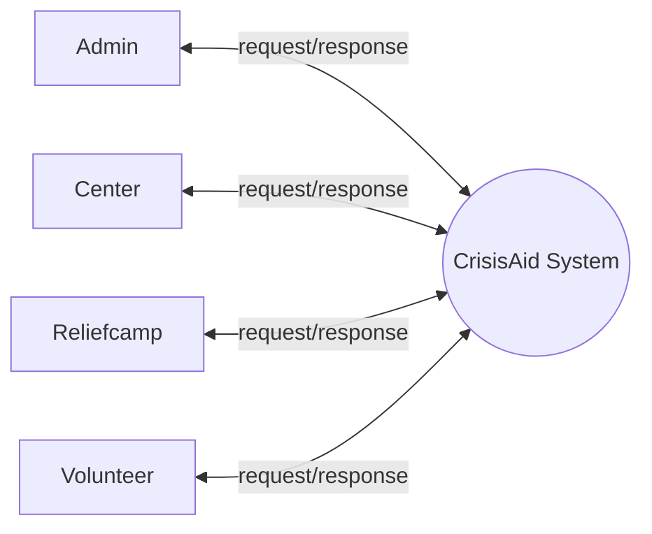
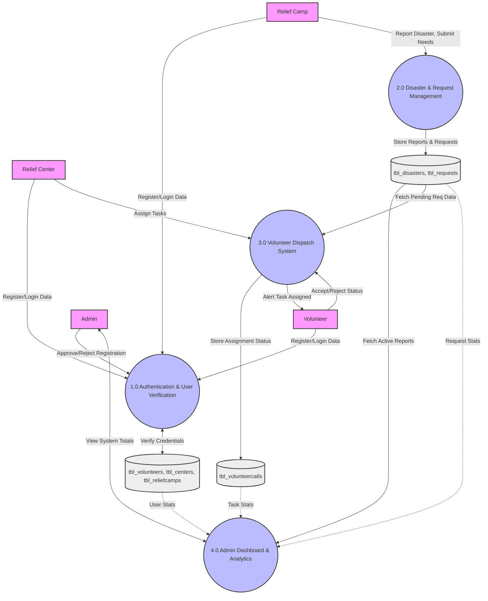
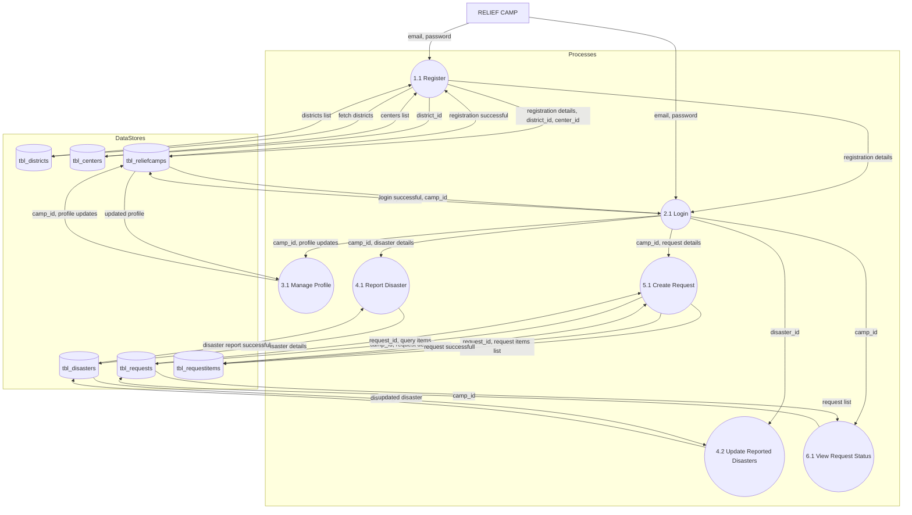
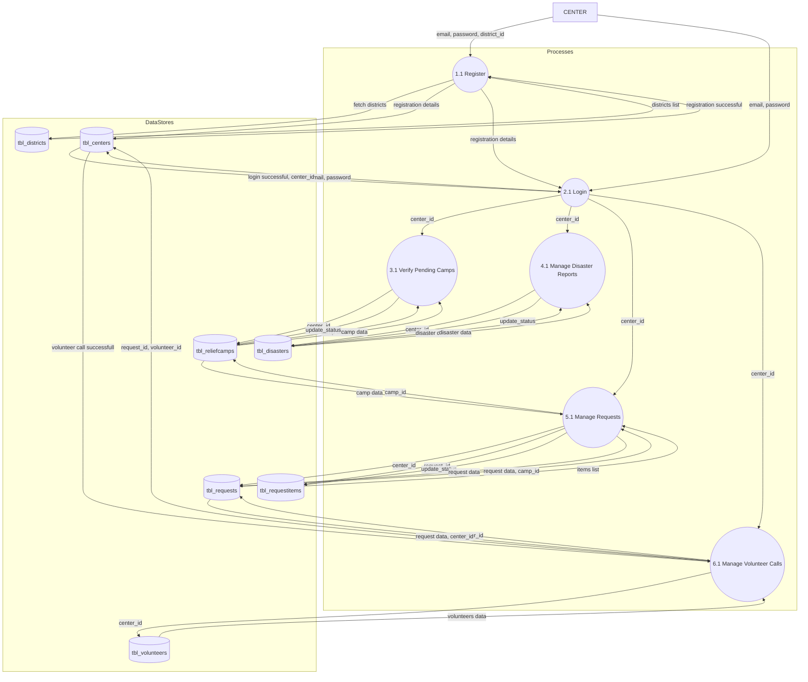
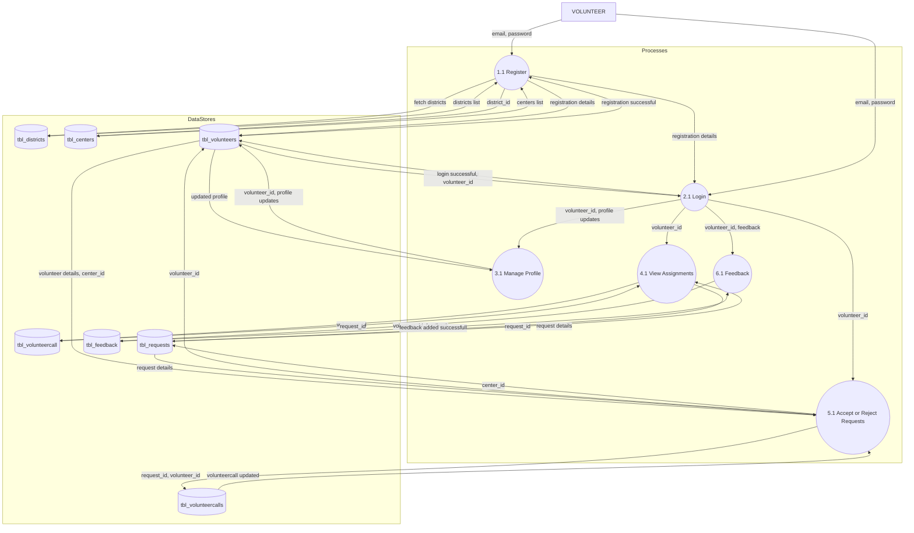
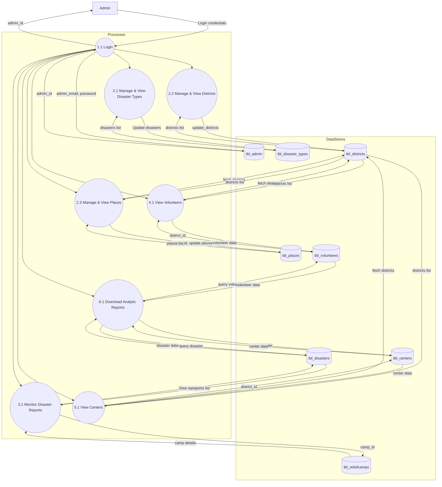

# CRISISAID PROJECT REPORT

## 1. INTRODUCTION

### 1.1 BACKGROUND AND MOTIVATION
Disasters, whether natural or man-made, occur with little warning and demand immediate, coordinated action to minimize loss of life and property. In many cases, the bottleneck in relief efforts is not a lack of resources or volunteers, but a lack of efficient communication and coordination between those on the ground and those willing to help. Existing systems often rely on fragmented social media threads, manual spreadsheets, or isolated communication channels which lead to delays, duplication of effort, and resource mismatch.

The motivation behind **CrisisAid** lies in creating a unified, real-time ecosystem that bridges the gap between relief camps, administrative centers, and a dedicated network of volunteers. By providing a centralized platform for reporting disasters and requesting specific aid, CrisisAid ensures that help reaches the right place at the right time. The system is designed to provide a safe and verified environment where every participant—from a camp manager to a local volunteer—has a clear role and actionable tasks.

### 1.2 THE PROPOSED SYSTEM
CrisisAid is a web-based disaster relief coordination platform designed to streamline the lifecycle of relief operations. It integrates modern web technologies to provide a responsive and secure environment for multiple stakeholders.

**From the Volunteer Perspective:**
*   **Verification System**: Volunteers submit photo IDs and proofs for admin verification to ensure a trusted network.
*   **Mission Acceptance**: Volunteers receive targeted "missions" based on camp requests and can accept or reject tasks based on their availability.
*   **Profile Management**: Dedicated dashboard to track accepted tasks and update real-time availability.

**From the Camp & Center Perspective:**
*   **Disaster Reporting**: Camps can quickly report disaster events and request specific manpower or resource assistance.
*   **Resource Allocation**: Centers act as hubs, receiving requests from camps and assigning verified volunteers to specific missions.
*   **Real-time Tracking**: Status updates (e.g., "Open", "Full", "Assigned") provide a live view of the relief landscape.

**From the Admin Perspective:**
*   **System Governance**: Complete control over center registration, volunteer verification, and disaster status monitoring.
*   **Reporting & Insights**: Ability to view system-wide impacts and manage the integrity of the data.

**Technological Stack:**
*   **Frontend**: Built with **React** and **Tailwind CSS**, providing a premium, interactive user experience with dynamic animations and a glassmorphic design aesthetic.
*   **Backend**: Powered by **Node.js** and **Express**, ensuring a robust and scalable API architecture.
*   **Database**: **MongoDB** with Mongoose ODM for flexible, document-based data storage.
*   **Security**: Implementation of **JWT (JSON Web Tokens)** for secure authentication and **Bcrypt** for sensitive data hashing.

### 1.3 PROJECT SCOPE
The scope of CrisisAid covers the entire flow of humanitarian assistance during a disaster. Key modules include:
*   A secure **Authentication Module** with role-based access control (Admin, Center, Camp, Volunteer).
*   A **Relief Camp Module** for incident reporting and resource requisition.
*   A **Volunteer Management Module** for onboarding, verification, and task assignment.
*   A **Center Dashboard** for operational oversight and volunteer dispatch.
*   A **Global Notification System** for real-time alerts and toast messages.

#### 1.3.1 Limitations
*   **Network Dependency**: As a web-based platform, it requires active internet connectivity, which can be challenging in severe disaster zones.
*   **Manual Verification**: Initial volunteer verification requires manual admin intervention, which may cause slight onboarding delays during peak demand.
*   **Device Requirements**: Optimized for modern browsers; performance may vary on older legacy systems.

#### 1.3.2 Advantages of Proposed System
*   **Verified Trust**: Only verified volunteers can accept missions, reducing the risk of mismanagement.
*   **Premium UI/UX**: A highly intuitive and aesthetic interface reduces cognitive load during high-stress disaster situations.
*   **Centralized Coordination**: Eliminates the "silo" effect by connecting camps directly to a pool of available volunteers via regional centers.
*   **Scalability**: The modular MERN stack architecture allows for easy expansion to add more resources (e.g., medical supplies, logistics tracking) in the future.

## 2. SYSTEM ANALYSIS

### 2.1 INTRODUCTION
Software Engineering is the systematic process of analyzing, designing, constructing, verifying, and managing software applications to ensure reliability and efficiency. To build software successfully, a structured process must be followed that carefully studies the problem domain and proposes a suitable solution.

System Analysis is one of the most important stages in software development. It involves a detailed study of the existing relief coordination systems and their shortcomings, followed by the identification of requirements for the new system. The aim of this phase is to understand the CrisisAid system at a deeper level by gathering information about operations, workflows, users, and data interactions. For the CrisisAid project, system analysis plays a critical role because it deals with multiple interconnected components such as user verification, disaster reporting, manpower allocation, and real-time status monitoring.

The process begins by studying how manual relief operations are conducted during disasters—identifying their limitations (such as slow communication, unverified volunteer risks, and lack of centralized data)—and then defining the objectives of the proposed system. This phase involves analyzing the expectations of potential users (volunteers and camp managers) and administrators to ensure the system addresses real-world problems.

The main goal of system analysis is to design a platform that is both efficient and user-friendly, while also ensuring high security and data integrity. The CrisisAid system is therefore analyzed from multiple perspectives:
*   **User Perspective**: Focused on simplicity in reporting disasters and clarity in mission acceptance.
*   **Admin Perspective**: Focused on providing full oversight of centers and a rigorous verification process for volunteers.
*   **System Perspective**: Ensuring seamless data flow between the React frontend, Node.js backend, and MongoDB database for real-time updates.

In general, the system analysis process for CrisisAid follows a structured approach including:
*   **Feasibility Study**: Determining whether the project is technically, economically, and operationally feasible.
*   **Fact-Finding**: Collecting requirements through research into disaster relief workflows and user interaction patterns.
*   **Requirement Analysis**: Identifying what users, centers, and admins expect from the platform.
*   **Problem Identification**: Analyzing limitations of current ad-hoc relief coordination methods.
*   **Proposed Solution**: Designing CrisisAid as a secure, interactive, and centralized coordination system.

### 2.2 STAKEHOLDERS OF THIS PROJECT
In the CrisisAid system, stakeholders are the individuals or groups who directly interact with or benefit from the platform. They play a crucial role in ensuring the platform's success and usability.

#### 2.2.1 Administrator
The administrator is the person who manages the overall web application. They have the highest level of privileges and full access to the system backend.
Key responsibilities include:
*   Managing and verifying volunteer registrations by reviewing photo IDs and proofs.
*   Overseeing the registration of Regional Relief Centers.
*   Monitoring system-wide disaster reports and operational statuses.
*   Ensuring the integrity and security of the platform.

#### 2.2.2 Regional Relief Centers
Centers act as the intermediate coordination hub between the administration and the on-ground relief units.
Key responsibilities include:
*   Processing aid requests received from various Relief Camps.
*   Assigning verified volunteers to specific missions/tasks.
*   Monitoring the progress of assigned tasks and managing volunteer pools for their district.

#### 2.2.3 Relief Camps
Camps are the frontline units located at disaster sites.
Key responsibilities include:
*   Reporting disaster incidents with details (location, type, severity).
*   Requesting specific manpower or resource assistance based on immediate needs.
*   Updating the status of their requests and providing on-ground situational awareness.

#### 2.2.4 Volunteers
Volunteers are the primary workforce of the system.
Key responsibilities include:
*   Submitting profile details and verification documents for security clearance.
*   Setting their real-time availability status.
*   Reviewing and accepting/rejecting assigned missions based on their location and skills.

### 2.3 SOFTWARE REQUIREMENT SPECIFICATION (SRS)
The SRS defines the functional requirements of the system, specifying the features and responsibilities of each stakeholder role.

#### 2.3.1 Administration & Centers
1.  The system should provide secure login with role-based access control.
2.  Admins must have a dedicated interface to approve or reject volunteer applications with a view of their submitted proofs.
3.  Centers should be able to view a list of "Pending Requests" from camps and assign available volunteers to them.
4.  The system must update request statuses automatically once the estimated volunteer requirement is met.
5.  Admins should have access to a dashboard displaying totals for volunteers, centers, and active disaster reports.

#### 2.3.2 Camps & Volunteers
1.  Relief camps must be able to create new requests specifying the disaster type and number of volunteers needed.
2.  Volunteers must have a multi-step registration process including name, address, phone, and document upload.
3.  The system should allow volunteers to toggle their availability status (Available/Unavailable) to control their visibility to centers.
4.  Volunteers should be able to view "My Assignments" with a history of past and current missions.
5.  All users must have the ability to update their profile information and reset their passwords securely.

### 2.4 FEASIBILITY STUDY
A feasibility study helps determine whether the proposed system is realistic, cost-effective, and technically achievable.

#### 2.4.1 Technical Feasibility
This evaluates whether the required technology, tools, and skills are available to build the system.
*   **Technologies Used**:
    *   **Frontend**: React.js with Tailwind CSS for a premium, responsive UI.
    *   **Backend**: Node.js and Express for high-performance server-side logic.
    *   **Database**: MongoDB for scalable, schema-less data storage.
    *   **Security**: Bcrypt for password hashing and JWT for session management.
*   **Stability**: The MERN stack is industry-standard, widely documented, and has strong community support.
*   **Scalability**: The system can be easily scaled by deploying to cloud platforms (like AWS or Atlas) and optimizing database queries.
*   **Skill Availability**: The project uses modern JavaScript technologies, ensuring that the development team has high technical feasibility.
**Conclusion**: CrisisAid is technically feasible.

#### 2.4.2 Operational Feasibility
This evaluates whether the proposed system will operate effectively in a real-world disaster environment.
*   **Ease of Use**: The system offers high-quality, intuitive interfaces designed to minimize user error during high-stress situations.
*   **Functionality**: All core workflows—from disaster reporting to volunteer dispatch—are automated, replacing slow manual processes.
*   **Improved Workflow**: Centralized data ensures that resources are allocated where they are most needed, preventing duplication of effort.
*   **Acceptance**: Stakeholders (camps and volunteers) benefit from clear task assignments and status transparency, leading to high projected adoption.
**Conclusion**: CrisisAid is operationally feasible.

#### 2.4.3 Economic Feasibility
This evaluates the cost-effectiveness of the system.
*   **Low Development Cost**: By using open-source technologies (MERN), licensing fees are eliminated.
*   **Efficiency Gains**: The system reduces the time and resources spent on manual coordination, which translates to indirect economic savings and potentially more lives saved.
*   **Maintenance**: Standardized code practices and widely used technologies make long-term maintenance affordable.
**Conclusion**: CrisisAid is economically feasible.

## 3. SYSTEM DESIGN

### 3.1 SYSTEM ARCHITECTURE
System architecture is primarily concerned with the internal interfaces among the system’s components or subsystems, and the interface between the system and its external environment, especially the user. The structural design reduces complexity, facilitates change, and results in easier implementation by encouraging parallel development of different parts of the system. CrisisAid is based on the **three-tier architecture model**:

**1. Presentation Layer (User Interface)**
*   Displays controls, receives, and validates user input using React.js and Tailwind CSS.
*   Volunteers and Camps can create accounts, log in, and browse dashboards.
*   Provides options for filtering tasks, viewing active disaster reports, and checking assignments.
*   Camps can submit disaster reports and request specific aid.
*   Admins and Centers use this layer to verify users, dispatch teams, and manage operations.

**2. Business Logic Layer**
*   Contains the application-specific logic of CrisisAid managed by Node.js and Express.
*   Handles request matching, volunteer assignments, status updates, and verification processes.
*   Processes report submissions: ensuring data integrity before saving it to the database.
*   Manages user roles and enforces role-based access so that admins, centers, and regular users have separate privileges (via JWT verification).

**3. Data Layer**
*   Stores and manages all application data in a MongoDB database using Mongoose schemas.
*   Maintains **user data**: Volunteer profiles, Admin credentials, Center details, and Relief Camp records.
*   Stores **operational data**: Disaster reports, volunteer assignments, and task histories.
*   Ensures reliable, secure, and scalable access to data, with support for concurrent use.

The important feature of the three-tier design is that information only travels from one level to an adjacent level. This ensures modularity, scalability, and maintainability for the CrisisAid system.

### 3.2 MODULE DESIGN
Modular programming is a software design technique that emphasizes separating the functionality of a program into independent, interchangeable modules. Different modules of this project include:

**1. User Authentication**
This module allows users to securely authenticate themselves into the system. Authentication ensures that only registered users and administrators can access the system.
*   **Volunteers/Camps/Centers** can log in using their email and password to access their respective operational dashboards.
*   **Administrators** can log in using their credentials to access admin-specific features like verifying users and overseeing regional centers.
*   This module enforces access control, ensuring that users and admins only perform actions according to their role.

**2. Registration & Verification**
This module handles the onboarding process for new entities.
*   **Volunteers** create an account by providing personal details and uploading verification documents (ID proof, photo).
*   **Camps and Centers** are registered to specific districts to ensure geographic coordination.
*   Registration ensures that operational activities (reporting disasters, accepting tasks) are linked to verified profiles.

**3. Disaster & Request Reporting**
This is the core operational module for Camps.
*   Camps can report new disasters (Cyclones, Floods, etc.) with severity flags.
*   Camps can create Requests for specific manpower or supplies.
*   Status updates are tracked in real-time (e.g., Pending, Active, Resolved).

**4. Volunteer Dispatch & Assignment**
This module bridges the gap between Center requests and Volunteer availability.
*   Centers view pending requests from camps and assign them to available volunteers in their district.
*   Volunteers receive assignment alerts and can proactively Accept or Reject the mission based on their current circumstances.
*   The system automatically monitors and updates the status of assignments once manpower requirements are met.

**5. System Administration**
This module provides the central Administration with oversight capabilities.
*   Approve or reject pending volunteer and center registrations.
*   View global statistics (total volunteers, active camps, critical disasters).
*   Add master data (e.g., new disaster types, new geographic locations).

### 3.3 DATABASE DESIGN
A database is an integrated collection of data providing centralized access. Designing a database is a complex task and normalization theory is a useful aid in the design process to eliminate redundancy and maintain data integrity. The data will be used in new ways; tuples will be added and deleted, and information stored will undergo updating. 

#### 3.3.1 Normalization
Normalization involves restructuring a relational database in accordance with a series of so-called normal forms. 
*   **First Normal Form (1NF)**: Ensures all attributes are based on a single domain and entries have at most single values.
*   **Second Normal Form (2NF)**: Ensures the table is in 1NF and every attribute is functionally dependent upon the whole key.
*   **Third Normal Form (3NF)**: Ensures the table is in 2NF and every non-key attribute is functionally dependent on just the primary key.

#### 3.3.2 Table Structure
The database for CrisisAid stores data in completely normalized JSON documents (Collections) via MongoDB. There are mainly 8 primary collections in the project. They are:

1.  **tbl_admins**
2.  **tbl_centers**
3.  **tbl_reliefcamps**
4.  **tbl_volunteers**
5.  **tbl_disasters**
6.  **tbl_requests**
7.  **tbl_volunteercalls**
8.  **tbl_districts**

**3.3.2.1 Collection: tbl_volunteers**
*Description:* Stores all registered volunteer information, including credentials, profile details, availability status, and verification documents.
| Field Name | Data Type | Constraints | Description |
| :--- | :--- | :--- | :--- |
| `_id` | ObjectId | Primary Key | Unique identifier for volunteer |
| `volunteer_name` | String | Required | Full name of volunteer |
| `volunteer_email`| String | Required, Unique| Contact email |
| `volunteer_password`| String | Required | Bcrypt hashed password |
| `district_id` | ObjectId | Foreign Key | Reference to tbl_districts |
| `availability` | Boolean | Default: true | Current operational status |
| `photo` | String | Optional | URL to submitted photo |
| `proof` | String | Optional | URL to submitted ID proof |

**3.3.2.2 Collection: tbl_requests**
*Description:* Stores aid requests generated by relief camps, tracking required manpower and current fulfillment status.
| Field Name | Data Type | Constraints | Description |
| :--- | :--- | :--- | :--- |
| `_id` | ObjectId | Primary Key | Unique identifier for request |
| `camp_id` | ObjectId | Foreign Key | Reference to tbl_reliefcamps |
| `disaster_type_id` | ObjectId | Foreign Key | Reference to tbl_disasters |
| `estimated_volunteers`| Number | Required | Target manpower needed |
| `accepted_volunteers`| Number | Default: 0 | Current fulfilled manpower |
| `request_status` | String | Default: pending | Pending, Assigned, Resolved |

**3.3.2.3 Collection: tbl_admins**
*Description:* Stores root administrator account information for system-wide governance.
| Field Name | Data Type | Constraints | Description |
| :--- | :--- | :--- | :--- |
| `_id` | ObjectId | Primary Key | Unique identifier for admin |
| `admin_name` | String | Required | Name of the administrator |
| `admin_email` | String | Required, Unique| Contact email |
| `admin_password` | String | Required | Bcrypt hashed password |

**3.3.2.4 Collection: tbl_centers**
*Description:* Stores details of Regional Relief Centers responsible for local coordination.
| Field Name | Data Type | Constraints | Description |
| :--- | :--- | :--- | :--- |
| `_id` | ObjectId | Primary Key | Unique identifier for center |
| `center_name` | String | Optional | Name of the relief center |
| `center_address` | String | Optional | Physical address of the center |
| `center_email` | String | Required, Unique| Contact email and login ID |
| `center_password` | String | Required | Bcrypt hashed password |
| `district_id` | ObjectId | Foreign Key | Reference to tbl_districts |
| `center_status` | String | Enum: OPEN, FULL, CLOSED| Operational status |
| `profileCompleted` | Boolean | Default: false | Onboarding completion flag |

**3.3.2.5 Collection: tbl_reliefcamps**
*Description:* Stores details of relief camps that act as ground-zero disaster reporting units.
| Field Name | Data Type | Constraints | Description |
| :--- | :--- | :--- | :--- |
| `_id` | ObjectId | Primary Key | Unique identifier for camp |
| `camp_name` | String | Required | Name of the relief camp |
| `camp_address` | String | Required | Physical location of the camp |
| `camp_email` | String | Required | Contact email and login ID |
| `camp_password` | String | Required | Bcrypt hashed password |
| `district_id` | ObjectId | Foreign Key | Reference to tbl_districts |
| `center_id` | ObjectId | Foreign Key | Reference to tbl_centers |
| `verification_status`| String | Default: null | Admin verification state |
| `current_occupancy` | Number | Default: 0 | Current number of people |

**3.3.2.6 Collection: tbl_disasters**
*Description:* Stores active and historical disaster reports submitted by relief camps.
| Field Name | Data Type | Constraints | Description |
| :--- | :--- | :--- | :--- |
| `_id` | ObjectId | Primary Key | Unique identifier for disaster event |
| `disaster_details` | String | Required | Description of the disaster |
| `disaster_photo` | String | Required | URL to visual proof/photo |
| `disaster_status` | String | Default: pending | Enum: pending, active, resolved, rejected |
| `center_id` | ObjectId | Foreign Key | Reference to coordinating tbl_centers |
| `reliefcamp_id` | ObjectId | Foreign Key | Reference to reporting tbl_reliefcamps |
| `disaster_type` | ObjectId | Foreign Key | Reference to tbl_disaster_type |

**3.3.2.7 Collection: tbl_volunteercalls**
*Description:* Tracks standard operating procedure (SOP) assignments between volunteers and specific disaster requests.
| Field Name | Data Type | Constraints | Description |
| :--- | :--- | :--- | :--- |
| `_id` | ObjectId | Primary Key | Unique identifier for assignment |
| `volunteer_id` | ObjectId | Foreign Key | Reference to assigned tbl_volunteers |
| `center_id` | ObjectId | Foreign Key | Reference to dispatching tbl_centers |
| `disaster_id` | ObjectId | Foreign Key | Reference to related tbl_disasters |
| `request_id` | ObjectId | Foreign Key | Reference to fulfilled tbl_requests |
| `task_status` | String | Default: assigned | Enum: assigned, accepted, completed, rejected |
| `proof_image` | String | Optional | URL to completion proof |

**3.3.2.8 Collection: tbl_districts**
*Description:* Stores geographic district representations used for system-wide region mapping.
| Field Name | Data Type | Constraints | Description |
| :--- | :--- | :--- | :--- |
| `_id` | ObjectId | Primary Key | Unique identifier for district |
| `districtName` | String | Required | Name of the geographic district |

**3.3.2.9 Collection: tbl_disaster_type**
*Description:* Stores predefined categories for disaster classification.
| Field Name | Data Type | Constraints | Description |
| :--- | :--- | :--- | :--- |
| `_id` | ObjectId | Primary Key | Unique identifier for disaster type |
| `disaster_type_name` | String | Required | Classification name (e.g., Flood, Fire) |

**3.3.2.10 Collection: tbl_feedback**
*Description:* Stores feedback and suggestions submitted by volunteers regarding operations or the system.
| Field Name | Data Type | Constraints | Description |
| :--- | :--- | :--- | :--- |
| `_id` | ObjectId | Primary Key | Unique identifier for feedback entry |
| `feedback_content` | String | Required | The content of the feedback message |
| `volunteer_id` | ObjectId | Foreign Key | Reference to tbl_volunteers |

**3.3.2.11 Collection: tbl_items**
*Description:* A catalog of resource items that can be requested during relief operations.
| Field Name | Data Type | Constraints | Description |
| :--- | :--- | :--- | :--- |
| `_id` | ObjectId | Primary Key | Unique identifier for item |
| `item_name` | String | Required, Unique | Name of the resource item |
| `unit` | String | Enum: kg, liters, etc. | Measurement unit for the item |
| `category` | String | Enum: food, medical...| Classification of the item |
| `is_active` | Boolean | Default: true | Determines if the item is currently listed |

**3.3.2.12 Collection: tbl_Place**
*Description:* Stores smaller geographic sub-regions (places) mapped within a specific district.
| Field Name | Data Type | Constraints | Description |
| :--- | :--- | :--- | :--- |
| `_id` | ObjectId | Primary Key | Unique identifier for place |
| `place_name` | String | Required | Name of the specific region/city |
| `district_id` | ObjectId | Foreign Key | Reference to tbl_districts |

**3.3.2.13 Collection: tbl_requestitems**
*Description:* Stores the specific quantity and details of resource items linked to a primary aid request.
| Field Name | Data Type | Constraints | Description |
| :--- | :--- | :--- | :--- |
| `_id` | ObjectId | Primary Key | Unique identifier for the request sub-item |
| `requestitem_name` | String | Required | Description/Name of requested resource |
| `requestitem_qty` | Number | Optional | Quantity of the requested item |
| `request_id` | ObjectId | Foreign Key | Reference back to tbl_request |

### 3.3.3 Data Flow Diagram 
 
#### 3.3.3.1 Introduction to Data Flow Diagrams 
A Data Flow Diagram (DFD) is a network that describes the flow of data and the processes that change, or transform, data throughout the system. This network is constructed by using a set of symbols that do not imply a physical implementation. It is a graphical tool for the structured analysis of system requirements. A DFD models a system by using external entities from which data flows to a process, which transforms the data and creates output data flows that go to other processes, external entities, or files. Data in files may also flow to processes as inputs. 

There are various symbols used in a DFD. Bubbles represent the processes. Named arrows indicate the data flow. External entities are represented by rectangles. Entities supplying data are known as sources and those that consume data are called sinks. Data are stored in a data store by a process in the system. Each component in a DFD is labeled with a descriptive name. Process names are further identified with a number. The Data Flow Diagram shows the logical flow of a system and defines the boundaries of the system. For a candidate system, it describes the input (source), outputs (destination), database (files) and procedures (data flow), all in a format that meets the user’s requirements. The main merit of a DFD is that it can provide an overview of system requirements, what data a system would process, what transformations of data are done, what files are used, and where the results flow. 

**Rules for constructing a Data Flow Diagram:** 
1. Arrows should not cross each other. 
2. Squares, circles, and files must bear names. 
3. Decomposed data flow squares and circles can have the same name. 
4. Choose meaningful names for data flows. 
5. Draw all data flows around the outside of the diagram.

#### 3.3.3.2 Level 0 DFD (Context Level)
The Level 0 DFD, also known as the Context Diagram, represents the entire CrisisAid system as a single high-level process with its relationship to external entities (Admins, Centers, Camps, and Volunteers).



#### 3.3.3.3 Level 1 DFD (Process Level)
The Level 1 DFD breaks down the main CrisisAid system into its major sub-processes, showing how data moves between the external entities, the core processes, and the database collections.



The Level 2 DFD decomposes the major processes from Level 1 to show more detailed data movement within each module.

**1. Relief Camp Module**


**2. Center Module**


**3. Volunteer Module**


**4. Admin Module**


#### 3.3.3.5 Level 3 DFD (Micro-Process / Internal Flow)
The Level 3 DFD is the most granular diagram, decomposing a specific Level 2 sub-process. This diagram breaks down **Process 3.3: Create Volunteer Call** into exact database checks.

```mermaid
graph TD
    %% Source / Sink
    Center[Center Input Data]
    Volunteer[Volunteer Notification]

    %% Level 3 Micro-Processes
    P3_3_1((3.3.1 Validate Volunteer ID))
    P3_3_2((3.3.2 Validate Request Manpower))
    P3_3_3((3.3.3 Insert Call Record))
    P3_3_4((3.3.4 Trigger System Alert))

    %% Data Stores
    D1[(tbl_volunteers)]
    D2[(tbl_requests)]
    D3[(tbl_volunteercalls)]

    %% Flows
    Center --> |"Volunteer_ID, Request_ID"| P3_3_1
    
    P3_3_1 --> |Check if Active & Available| D1
    D1 -.-> |Valid| P3_3_2
    
    P3_3_2 --> |Check Target vs. Accepted| D2
    D2 -.-> |Needs Manpower| P3_3_3
    
    P3_3_3 --> |Write {status: 'assigned'}| D3
    P3_3_3 --> |Generate Context| P3_3_4
    
    P3_3_4 --> |Real-time Toast/Push| Volunteer

    %% Styling
    classDef io fill:#fdc,stroke:#333,stroke-width:2px;
    classDef process fill:#bbf,stroke:#333,stroke-width:2px,shape:circle;
    classDef datastore fill:#eee,stroke:#333,stroke-width:2px,shape:cylinder;
    
    class Center,Volunteer io;
    class P3_3_1,P3_3_2,P3_3_3,P3_3_4 process;
    class D1,D2,D3 datastore;
```

### 3.4 INTERFACE DESIGN

#### 3.4.1 Purpose
Interface Design focuses on the layout, navigation, and overall usability of the system’s user interfaces. Its goal is to make the system intuitive, easy to use, and visually appealing, ensuring that users can interact with the platform efficiently without confusion or errors.

In the context of the CrisisAid system, interface design defines how users access various features such as disaster reporting, volunteer registration, mission management, and admin dashboards. It includes the arrangement of menus, buttons, forms, and dashboards so that information is presented logically and users can navigate between screens smoothly. For example, the dashboard provides an overview of active disasters and volunteer availability, while clear menus allow users to quickly access registration, login, request management, and system governance sections.

Good interface design also incorporates consistency in fonts, colors, and layouts, along with visual cues such as icons, tooltips, and error messages, to guide users and enhance usability. By prioritizing user experience, the interface design ensures that users of all technical levels—from on-ground camp managers to local volunteers—effectively interact with the system, complete tasks quickly, and enjoy a seamless relief coordination process.

Good interface design not only improves usability but also enhances user satisfaction and engagement. By providing a consistent and visually appealing layout, users can quickly understand the system’s functionality, navigate between screens effortlessly, and perform actions such as reporting incidents, assigning volunteers, or submitting feedback with ease. This contributes to a smoother and more efficient disaster relief operation.

## 4. IMPLEMENTATION

Implementation is the stage of the project when the theoretical design is turned into a working system. The implementation stage is a systems project in its own right. It includes careful planning, investigation of current system and its constraints on implementation, design of methods to achieve the changeover, training of the staff in the changeover procedure and evaluation of changeover method.

### 4.1 CODING STANDARDS

CrisisAid follows modern JavaScript (ES6+) and React coding standards to ensure consistency and maintainability across the MERN stack. Adhering to these common standards makes the code easy to read, manage, and refer to in the future, resulting in a codebase that is formalized and industry-oriented.

Below are the key guidelines followed in the CrisisAid project:

1.  **Javascript & React Syntax**: Standard ES6 features such as arrow functions, destructuring, and template literals are used. In React, functional components and Hooks are used to build interactive UI elements.
2.  **Commenting**: Standard JavaScript commenting style is followed:
    -   `//` for single-line comments.
    -   `/* ... */` for multi-line or block comments.
    Comments are used to explain complex logic, describe function parameters, and mark major sections of a file.
3.  **Line length and Indentation**: Lines are ideally kept within 80-120 characters for readability. Indentation uses **2 spaces** to maintain a clean and structured look across nested JSX and JSON objects.
4.  **Control Flow Statements**: Conditional and loop statements (if, for, while, switch) include a single space between the keyword and the opening parenthesis to distinguish them from function calls.
    Example:
    ```javascript
    if (n > 0) {
      console.log("Positive");
    } else if (n < 0) {
      console.log("Negative");
    } else {
      console.log("Zero");
    }
    ```
5.  **Function Definition & Calls**:
    -   While defining or calling a function, there is no space between the function name and the opening parenthesis.
    -   Arrow functions are preferred for component definitions and internal logic.
    Example:
    ```javascript
    const addNumbers = (num1, num2) => {
      return num1 + num2;
    };
    console.log(addNumbers(5, 6)); // No space after function name
    ```
6.  **Naming Conventions**:
    -   **Variables & Functions**: `camelCase` (e.g., `isAvailable`, `handleLogout`).
    -   **React Components**: `PascalCase` (e.g., `CampDashboard`, `StatCard`).
    -   **Constants**: `UPPER_SNAKE_CASE` (e.g., `API_BASE_URL`).
7.  **Block Alignment**: Opening curly braces `{` are placed on the same line as the statement or function definition (K&R style), and closing braces `}` are aligned with the start of the matching statement.
8.  **Modular Functions**: Functions are kept short and focused on a single responsibility. Large components are broken down into smaller, reusable sub-components to ensure the code remains manageable.
9.  **Asynchronous Operations**: `async/await` syntax is used consistently for all API requests (via Axios) to handle asynchronous data flow in a readable manner.

### 4.2 SAMPLE CODE

The following code snippets demonstrate the core implementation logic of the CrisisAid system, featuring the backend authentication controller and a frontend dashboard component.

#### 4.2.1 Backend Controller (Node.js/Express with Mongoose)

This sample shows the centralized login logic that handles different user roles (Admin, Center, Camp, Volunteer) and implements secure session management using JWT.

```javascript
// Server/controllers/auth.controller.js
const bcrypt = require("bcrypt");
const jwt = require("jsonwebtoken");
const Camp = require("../models/reliefcamp");
const Centers = require("../models/centers");

exports.login = async (req, res) => {
  try {
    const { email, password } = req.body;
    let user = null;
    let role = null;

    // Identify user role based on email
    const camp = await Camp.findOne({ camp_email: email });
    if (camp) { user = camp; role = "camp"; }

    const center = await Centers.findOne({ center_email: email });
    if (!user && center) { user = center; role = "center"; }

    // Authentication Check
    if (!user) return res.status(401).json({ message: "Invalid credentials" });

    const isMatch = await bcrypt.compare(password, user.password);
    if (!isMatch) return res.status(401).json({ message: "Invalid credentials" });

    // Generate Token
    const token = jwt.sign(
      { id: user._id, role: role },
      process.env.JWT_SECRET,
      { expiresIn: "1d" }
    );

    // Secure Cookie Storage
    res.cookie("token", token, {
      httpOnly: true,
      sameSite: "lax",
      maxAge: 86400000 
    });

    res.status(200).json({ message: "Login successful", role });
  } catch (err) {
    res.status(500).json({ message: "Server error" });
  }
};
```

#### 4.2.2 Frontend Component (React with Tailwind CSS)

This sample demonstrates how the Relief Camp dashboard fetches real-time data and manages UI state.

```jsx
// Client/src/Reliefcamp/Pages/CampDashboard/CampDashboard.jsx
import React, { useEffect, useState } from "react";
import axios from "axios";

const CampDashboard = () => {
  const [dashboard, setDashboard] = useState(null);
  const [loading, setLoading] = useState(true);

  useEffect(() => {
    const fetchStats = async () => {
      try {
        const res = await axios.get("http://localhost:5000/camp/home");
        setDashboard(res.data);
        setLoading(false);
      } catch (err) {
        console.error("Dashboard error:", err);
      }
    };
    fetchStats();
  }, []);

  if (loading) return <div>Loading...</div>;

  return (
    <div className="p-8 bg-slate-50 min-h-screen">
      <h1 className="text-3xl font-bold text-slate-800 mb-6">
        {dashboard.camp.camp_name} Dashboard
      </h1>
      
      <div className="grid grid-cols-1 md:grid-cols-3 gap-6">
        <div className="p-6 bg-white rounded-xl shadow-sm border">
          <p className="text-slate-500 text-sm">Total Requests</p>
          <h2 className="text-2xl font-bold text-blue-600">{dashboard.stats.total}</h2>
        </div>
        {/* Additional stat cards... */}
      </div>
    </div>
  );
};
```

## 5. TESTING

Coding conventions are a set of guidelines for a specific programming language that recommend programming style, practices, and methods for each aspect of a program written in this language. These conventions cover file organization, indentation, comments, declarations, naming conventions, and architectural best practices. Adhering to these guidelines ensures high software structural quality, improves code readability, and makes software maintenance easier for the development team.

### 5.1 TEST CASES

The objective of system testing is to ensure that all individual programs are working as expected, that the modules link together to meet the specified requirements, and that the computer system works seamlessly with the associated workflows.

The initial phase of testing involves determining the conditions to be tested, generating test data (such as mock API payloads), and producing a schedule of expected results. Once the developer is satisfied with the internal stability of the system, it is handed over to the users for final verification. During testing, the system is used experimentally to ensure that the software does not fail and that it will run according to its specifications. Special test data is input for processing, and the results are examined to locate and fix unexpected behaviors.

Testing is the major quality control measure during software development. Its basic function is to detect and uncover requirement, design, and coding errors. The goal is to reach a stage where the user can verify the system and provide the final approval for deployment.

The different types of testing performed in CrisisAid include:
1.  **Unit Testing**
2.  **Integrated Testing**
3.  **Black Box Testing**
4.  **White Box Testing**
5.  **Validation Testing**
6.  **User Acceptance Testing**

#### 5.1.1 Unit Testing

In computer programming, unit testing is a method by which individual units of source code—such as specific React components or Node.js controller functions—are tested to determine if they are fit for use. Unit testing focuses verification efforts on the smallest units of software design.

For CrisisAid, each module (Admin, Center, Camp, Volunteer) is tested individually before being integrated into the overall system. This testing is carried out during the development stage itself. Each function is verified to work satisfactorily regarding its expected output. Validation checks are also implemented to verify that data input given by users (such as registration forms or disaster reports) is both formally correct and valid according to business rules. This granular approach makes it very easy to find and debug errors before they propagate to the rest of the system.

#### 5.1.2 Integration Testing

Integration testing (sometimes called integration and testing, abbreviated I&T) is the phase in software testing in which individual software modules are combined and tested as a group. Software components may be integrated in an iterative way or all together ("big bang"). Normally the former is considered a better practice since it allows interface issues to be located more quickly and fixed.

Integrated testing is the systematic testing for constructing and uncovering errors within the interface. Data can be lost across an interface; one module can have an adverse effect on other sub-functions when combined, or may not produce the desired outputs. This testing was done with sample data to ensure the viability of each unit before combining them. We have performed integration testing whenever we have combined two modules together (e.g., connecting the Relief Camp request submission to the Center's dashboard view). When two modules are combined, we check whether the data flows correctly across the API boundaries and if the system works as a cohesive whole. This method reduces the analytical complexity by identifying problems at the interface level progressively.

#### 5.1.3 Validation Testing

At the culmination of integration testing, where software is completely assembled as a package and interface errors have been corrected, a final series of validation tests begins. Validation succeeds when the software functions in a manner that can be reasonably accepted by the customer. After validation tests are conducted, one of two possible conditions exists:
1. The function or performance characteristics conform to specification and are accepted.
2. A deviation from specification is uncovered and a deficiency list is created for further refinement.

In CrisisAid, we have implemented extensive validation in our forms (registration, disaster reporting, request creation) to ensure a neat and consistent format for the data entered on the website. We have also implemented unique constraints and existence checks (e.g., preventing duplicate email registration) to reduce data redundancy and ensure data integrity across the MongoDB collections.

#### 5.1.4 User Acceptance Testing

Acceptance Testing is a level of the software testing process where the system is tested for acceptability. User Acceptance Testing (UAT) validates the end-to-end business flow and ensures the system meets the requirements as per the original specification. UAT is typically performed after system testing is complete and the major defects have been resolved.

This testing is conducted in the final stage of the Software Development Life Cycle (SDLC) prior to the system being delivered to a live environment. UAT involves the end users concentrating on real-world, end-to-end scenarios. It is the final confirmation from the stakeholders that the system is ready for production. For CrisisAid, UAT involves verifying that a volunteer can successfully register, be approved by an admin, and then accept a mission assigned by a center, completing the full lifecycle of a disaster relief operation.

### 5.2 TEST CASE DOCUMENTS

A test case is a set of conditions or variables under which a tester will determine whether a system under test satisfies requirements or works correctly. The process of developing test cases can also help find problems in the requirements or design of an application. A sample of the test case document for CrisisAid is given below:

| TC No. | Test Steps | Expected Result | Actual Result | Status | Comment |
| :--- | :--- | :--- | :--- | :--- | :--- |
| 1 | Run application and navigate to Register screen. | The user registration screen is displayed with fields for username, email, and password. | The registration screen is displayed with all necessary fields and a Register button. | pass | |
| 2 | Click 'Register' without entering name, email, or password. | A message should be displayed stating 'Please fill out the field' beside the Name textbox. | A validation message was displayed beside the Name field as expected. | pass | |
| 3 | Click 'Register' after entering Name but leaving Email/Password empty. | A validation message should appear beside the Email textbox. | Message 'Please fill out the field' appeared beside of email textbox. | pass | |
| 4 | Click 'Register' after entering Name and Email but leaving Password empty. | A validation message should appear beside the Password textbox. | Message 'Please fill out the field' appeared beside of password textbox. | pass | |
| 5 | Click 'Register' after entering all valid details (Name, Email, Password). | System should redirect the user to the OTP verification page. | User was successfully redirected to the OTP verification page to validate account. | pass | |
| 6 | Enter valid OTP and click 'Continue'. | Message indicating successful registration; redirect to Login/Home screen. | Registration successful message displayed and user redirected to home. | pass | |
| 7 | Navigate to Login page and click 'Login' without entering credentials. | Validation message should stay 'Please fill out the field' beside email. | Message 'Please fill out the field' appeared beside the email textbox. | pass | |
| 8 | Click 'Login' after entering Email but without Password. | Validation message should appear beside the password textbox. | Message 'Please fill out the field' appeared beside the password textbox. | pass | |
| 9 | Click 'Login' after entering valid Email and Password. | Message 'Login successful! Redirecting to homepage.' | Login successful confirmation shown and user redirected to dashboard. | pass | |
| 10 | Navigate to Disaster Gallery and apply desired filters (District/Type). | System should display only incidents matching the selected criteria. | Only relevant disaster reports were displayed based on active filters. | pass | |
| 11 | Navigate to 'Create Disaster' section and click 'Create'. | System should open the disaster reporting interface for data entry. | Disaster creation interface opened, allowing user to enter event details. | pass | |
| 12 | Click 'Create' without entering Name of the disaster. | Message should be displayed: 'Please fill out the field' beside name textbox. | Validation triggered successfully for the disaster name field. | pass | |
| 13 | Click 'Create' without entering Disaster Description. | Validation message should appear beside the Description textbox. | 'Please fill out the field' shown next to the description field. | pass | |
| 14 | Click 'Create' after entering all mandatory disaster details. | User should be redirected to the Incident List or Confirmation page. | Disaster report successfully saved and user redirected to the list view. | pass | |
| 15 | Navigate to 'Volunteer Requests' and click 'Create Request'. | System should open a modal/page to define manpower needs. | Room/Request creation interface opened for defining relief requirements. | pass | |
| 16 | Click 'Create Request' without entering title or requirements. | Message 'Please fill out the field' beside title textbox. | Validation message displayed correctly for mandatory request fields. | pass | |
| 17 | Click 'Create Request' with title but no description. | Validation message should appear beside the description field. | 'Please fill out the field' appeared next to the description textbox. | pass | |
| 18 | Click 'Create Request' without selecting a priority level/icon. | Message 'Please select an item from the list' in beside of selection box. | Priority selection was validated successfully before submission. | pass | |
| 19 | Click 'Create Request' without selecting a target district. | Message 'Please select an item from the list' in beside of district selector. | District selection validated correctly. | pass | |
| 20 | Click 'Create Request' with all valid operational data. | System should redirect user to the active assignments/requests view. | Request created successfully and user redirected to coordinator view. | pass | |
| 21 | Navigate to 'Edit Profile' and click the edit button. | An edit profile modal/form should be displayed with current data. | Edit profile interface loaded with prepopulated user information. | pass | |
| 22 | Click on action buttons (Update/Delete) in profile edit. | System should show corresponding warnings or confirmations. | Warning messages and confirmation prompts displayed as expected. | pass | |

## 6. CONCLUSION

The CrisisAid project was successfully completed within the allotted timeframe. All modules were tested individually, integrated, and verified with real data, ensuring the system functions as intended. The project has fulfilled all the objectives defined at the start.

The system provides a unified platform that connects relief units with a verified volunteer workforce, making it easy for coordinators to access information and interact with the system efficiently. Users can report disasters, manage their profiles, and engage with relief missions in a seamless manner.

**Key benefits of the system include:**
*   **Ease of Use**: The website is designed with a premium, glassmorphic UI for a simple, intuitive user experience, allowing users to navigate and interact without difficulty during high-stress situations.
*   **Data Management**: CrisisAid stores all disaster reports, resource requests, and volunteer activities in a structured format, enabling easy retrieval and real-time oversight.
*   **Administrative Control**: Admins can monitor the system’s overall performance, verify volunteer identities, and maintain operational records systematically.
*   **Enhanced Coordination**: Centers can track past activities, manage volunteer availability, and dispatch aid tailored to the specific needs of relief camps.

The system also prioritizes security and reliability, ensuring user data is protected via JWT and Bcrypt, and minimizing the risk of unauthorized access. While active participation from users is essential for optimal performance, the system’s modern and digital-friendly design makes it accessible to a broad audience of tech-savvy volunteers.

Additionally, CrisisAid supports modular operational options, enabling personalized experiences such as district-based filtering, real-time toast notifications, and categorization of disaster types. By providing consistent access to relevant mission data, the system enhances engagement, improves relief efficiency, and contributes positively to humanitarian efforts.

The CrisisAid system successfully meets its intended goals, offering a digital, user-friendly platform that connects camps, volunteers, and administrators efficiently. It simplifies coordination processes, saves time and effort, and provides a reliable environment for stakeholders to respond to crisis situations effectively.

### 6.1 Future Enhancements

The CrisisAid system has been designed to be flexible and modular, allowing the addition of new features with minimal effort. This ensures that the platform can continue evolving to meet the changing needs of disaster management teams.

**Potential future enhancements for CrisisAid include:**
1.  **AI-Powered Resource Matching**: Using machine learning to automatically suggest the best-suited volunteers based on their skills and proximity to a disaster site.
2.  **Real-Time Logistics Tracking**: Integrating GPS tracking for supply delivery and volunteer movements to provide a live map-view of relief efforts.
3.  **Offline-Sync Capability**: Implementing Service Workers (PWA) to allow for basic data entry in environments with intermittent internet connectivity.
4.  **Integrated Communication Hub**: Adding a real-time chat feature between relief camps and coordinating centers for rapid instruction sharing.
5.  **Public Transparency Dashboard**: A landing page for the general public to view verified relief needs and contribute via donations or verified off-platform supplies.
6.  **Advanced Analytics & Heatmaps**: Providing admins with detailed heatmaps of disaster frequency and volunteer density to optimize future regional center placement.

These enhancements will make CrisisAid more interactive, secure, and operationally effective, ensuring a seamless disaster response experience while keeping the platform adaptable for future global humanitarian needs.
